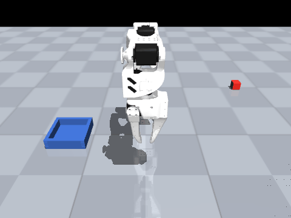
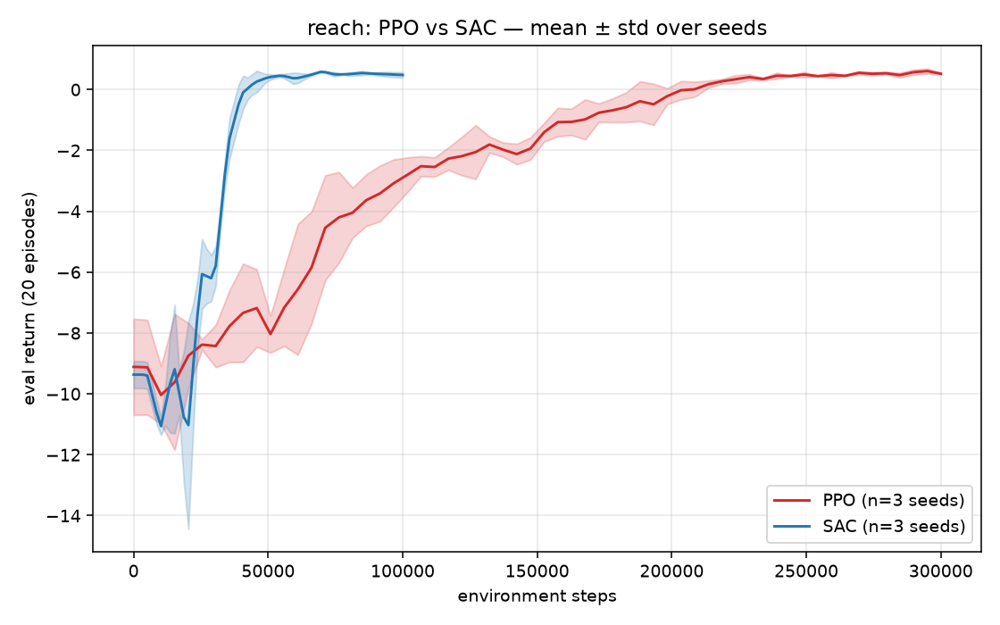
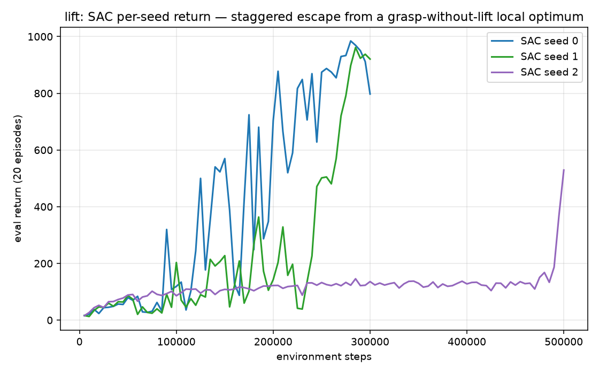

# WorkCell Part D — PolicyForge: model-free RL vs a learned world model

> **Part D of the _WorkCell_ series** — one simulated industrial work-cell, five learning approaches:
> [A · imitation](https://github.com/ahmedsohail2003/workcell-partA-imitation) ·
> [B · VLA](https://github.com/ahmedsohail2003/workcell-partB-vla) ·
> [C · grasping](https://github.com/ahmedsohail2003/workcell-partC-grasping) ·
> [D · RL + world model](https://github.com/ahmedsohail2003/workcell-partD-rl) ·
> E · ROS 2 (in progress) ·
> [datasets & models on 🤗](https://huggingface.co/ahmedsohail2003)

**Reinforcement learning and model-based control on the author's SO-ARM100
MuJoCo work-cell** — the same robot and scene as the companion projects
[Part A · Sim2Cell](https://github.com/ahmedsohail2003/workcell-partA-imitation) (imitation learning) and [Part C · GraspSight](https://github.com/ahmedsohail2003/workcell-partC-grasping)
(classical perception + planning). Three learning paradigms, one robot:

| Project | Paradigm | How the task gets solved |
|---|---|---|
| sim2cell | Imitation learning | Copy a scripted expert from pixels (ACT) |
| graspsight | Model-based, engineered | Perceive → estimate pose → plan a grasp |
| **policyforge** | **Reinforcement learning** | **Discover the behavior from reward** |



## The headline: sample efficiency, measured

Reach task (drive the TCP into a 2 cm ball around a random reachable target),
success rates over 20 fixed-seed eval episodes:

| Method | Environment steps | Success |
|---|---|---|
| **Learned dynamics + CEM-MPC** (from scratch) | **8,000** | **100%** |
| SAC (off-policy, 3 seeds) | 100,000 | 97% (95–100%) |
| PPO (on-policy, 3 seeds) | 300,000 | 100% (3/3 seeds) |

The textbook hierarchy — model-based ≫ off-policy ≫ on-policy in sample
efficiency — reproduced end to end on our own hardware model rather than a
benchmark: the world-model planner reached 100% with **37× fewer environment
interactions than PPO** and **12× fewer than SAC**.



**Honest scope note:** these are conditions that *favor* model-based control —
fully observed low-dimensional state, a known reward function, short horizons,
smooth deterministic dynamics. The comparison measures sample efficiency under
those conditions; it does not claim CEM-MPC beats RL in general.

## The world model

[`worldmodel.py`](src/policyforge/worldmodel.py) — deliberately minimal and
**structure-aware**: the actuator-setpoint update `ctrl' = clip(ctrl + a·Δ)`
is known dynamics and computed analytically, so the ensemble (3 × MLP,
normalized delta targets) learns only the true unknowns — next
`[qpos, qvel, tcp]`. The CEM planner rolls the ensemble mean forward over a
15-step horizon (256 candidates × 4 CEM iterations, warm-started, MPC
replanning every step) and never touches the simulator: it acts from
imagination, corrected by reality once per control step.

PETS-style iterative loop: round 0 trains on 8k random-policy transitions —
**and already plans at 100%**; three more planner-collected rounds shrink the
model loss 5× without changing success (the task was solved; the extra data
just sharpens the model).

## Lift: a contact-rich task, solved as a reward-design study

Reach validates the RL plumbing; **Lift** — grasp a block and lift-and-hold it
clear of the table — is where the real work is. Getting an honest policy took
fixing one environment bug and iterating through four reward designs, each of
which exposed the next failure mode. The progression *is* the result:

| Stage | Reward design | Result | What broke, and why |
|---|---|---|---|
| — | *(any)* | 1-step episodes | `reset()` skipped `_reset_arm()`: stale physics + un-zeroed step counter → every episode after the first truncated instantly. Forensic tell: eval episode length pinned at exactly (150+19)/20 = 8.45, identical across seeds. One-line fix, regression-tested. |
| v0 | terminate on success, one-time +5 bonus | **0 / 20** | Policy grasps and lifts to a median 6.3 cm, then **hovers just below the 7 cm line**. Ending the episode on success forfeited ~120 (discounted) of future dense shaping for a one-time +5 — so *never succeeding* is optimal. An IK sweep proved the block is liftable to ~0.5 m, so the ceiling was the reward, not the arm. |
| v2 | lift-and-hold: per-step in-goal bonus, never terminate early | **20 / 20** | Incentive fixed, but the monotonic lift term saturates at 8.2 cm and the bonus is flat above the line → no gradient to stop, so the arm exploits the unbounded lift and **over-extends to ~0.5 m** (a real grasp, but an unnatural yank). |
| v3 | tent reward peaking at a 14 cm target height | 6 / 20 | Height natural now — but spreading the climb reward over 0→14 cm halved the near-floor gradient (0.23 vs 0.43 per cm), so the **block often never leaves the table**. |
| **v4** | **steep climb-to-7 cm + soft cap above the target** | **shipped** | Steep climb restores the reliable "get off the table" drive; the cap replaces v2's flat top, so the block settles at a **natural ~16 cm**. |


**Results — SAC, 3 seeds, 20 fixed-seed eval episodes each** (disjoint from
training seeds):

| Seed | Env steps | Success | |
|---|---|---|---|
| 0 | 300k | **90%** | clean grasp → lift → hold at ~16 cm |
| 1 | 300k | 75% | |
| 2 | 500k | 55% | escaped the local optimum late — see below |
| **mean** | | **73%** | |

**Why the spread — a stochastic local optimum.** Every seed first gets stuck at
a **grasp-without-lift** plateau (~120 return: it reaches and closes on the block
but never lifts), then escapes it discontinuously. Escape is a matter of *when*,
not *if*: seed 0 broke through by ~150k, seed 1 at ~250k, and seed 2 sat on the
plateau for **480k steps** before jumping. At a fixed 300k budget that reads as
90/75/0%; giving seed 2 the steps to escape recovers 55% and shows the 0 was
under-training, not incapacity.



Per-seed curves are shown deliberately instead of a mean±std band — the band
would smear together exactly the staggered breakthroughs that are the point.
This is the honest shape of off-policy RL on a sparse-contact task: reliable
*per escape*, high-variance in *when* the escape happens.

## Environments

[`envs.py`](src/policyforge/envs.py) — Gymnasium API on the work-cell:

- **Reach** — random 3D target, dense `-distance` reward, success bonus,
  termination inside 2 cm. Targets are **validated reachable by IK at sample
  time** (a 7/10 scripted-probe failure traced to unreachable high-radius
  samples; solvability is now an env property, not a training-time surprise).
- **Lift** — grasp the block and lift-and-hold it at a natural pick height
  (~16 cm): reach shaping + proximity-gated grasp term + a steep climb-to-7 cm
  term with a soft cap above the target, a per-step in-goal bonus, and no early
  termination (success = held above the line at episode end). The reward went
  through four designs to get there — see the study above.

Actions are bounded deltas on the position-actuator setpoints; observations
include the setpoints (Markov-completeness — the actuators are stateful).

## Reproducibility discipline

- 3 seeds per algorithm, seeded envs *and* algorithms
- Fixed-seed eval env, disjoint from training seeds; 20 episodes per eval
- Eval every 5k steps; histories in `evaluations.npz` per run
- Post-hoc success protocol identical across algorithms ([`eval_success.py`](scripts/eval_success.py))
- All hyperparameters in [`train.py`](scripts/train.py) (PPO: 8 vec envs,
  n_steps 256, batch 512, lr 3e-4, γ 0.98; SAC: batch 256, buffer 300k,
  lr 3e-4, learning_starts 2k)

## Reproduce

```bash
pip install mujoco gymnasium stable-baselines3 torch scipy matplotlib imageio
python scripts/verify_env.py                     # env gates + scripted solvability probe
python scripts/train.py --algo sac --task reach --seed 0 --steps 100000
python scripts/train_worldmodel.py 0             # model-based loop, ~13 min
python scripts/train.py --algo sac --task lift  --seed 0 --steps 300000   # ~2.5 h (500k for a stuck seed)
python scripts/eval_success.py reach             # success table (also: lift)
python scripts/plot_curves.py reach              # learning curves (also: lift, per-seed)
python scripts/rollout_gif.py outputs/runs/lift_sac_s0/best_model.zip lift  # demo GIF
```

## Asset provenance

Arm model vendored from [MuJoCo Menagerie](https://github.com/google-deepmind/mujoco_menagerie)
(`trs_so_arm100`, Apache-2.0) via the author's sim2cell project (TCP site +
wrist camera patches documented there).

## License

Apache-2.0
